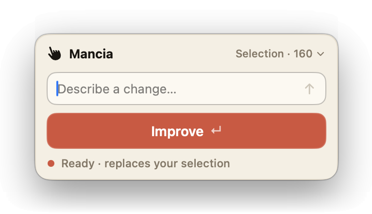

<p align="center">
  
</p>

# Mancia

<p align="center">
  <a href="LICENSE"></a>
  
  
</p>

Mancia is a small macOS menu bar app for editing text with AI anywhere you type.
Select text in any app, press a hotkey, and Mancia rewrites the text in place.
No chat window, no copy-paste loop.

It currently uses the local GitHub Copilot CLI as its provider.

<p align="center">
  
</p>

## What It Does

- Works system-wide with a global hotkey, defaulting to `Control-Option-Command-E`.
- Opens a compact floating panel near your cursor.
- Edits the current selection, or the whole document when nothing is selected.
- Offers a one-tap **Improve** action (proofread and rewrite combined) plus a free-form instruction field for anything else.
- Applies results in place and lets you move between the original and generated versions.
- Restores your clipboard after each capture and paste.
- Runs as a menu bar app with no Dock icon.

## Requirements

- macOS 14 or newer.
- GitHub Copilot CLI installed and signed in:

```sh
npm install -g @github/copilot
copilot
```

Mancia shells out to the `copilot` binary in non-interactive mode. It does not
talk to an AI API directly.

## Install From Source

Mancia is a Swift Package Manager project. There is no Xcode project.

```sh
cd path/to/mancia
make app
open build/Mancia.app
```

To install it permanently, copy `build/Mancia.app` to `/Applications`.

Or build a distributable disk image with `make dmg`, which produces
`build/Mancia-<version>.dmg`. Open it and drag Mancia onto the Applications
shortcut to install.

### Gatekeeper note

Mancia is not notarized. The first time you open a build you downloaded or
copied from a DMG, macOS may refuse to launch it ("Mancia can't be opened
because Apple cannot check it for malicious software"). Right-click the app and
choose **Open**, then confirm; or open **System Settings > Privacy & Security**
and click **Open Anyway**. You only need to do this once per build. Builds you
compile yourself with `make app` are not quarantined and open normally.

Useful development commands:

| Command | What it does |
| --- | --- |
| `make build` | Debug build with `swift build`. |
| `make test` | Runs unit tests. |
| `make app` | Builds and assembles `build/Mancia.app`. |
| `make dmg` | Builds `build/Mancia-<version>.dmg` for drag-to-install. |
| `make run` | Builds the app bundle and opens it. |
| `make clean` | Removes SwiftPM and app build output. |

## First Run

Mancia needs macOS Accessibility permission so it can copy the current
selection and paste the result back into the frontmost app.

1. Open Mancia.
2. Trigger the hotkey or choose **Edit Selection...** from the menu bar icon.
3. When macOS prompts, enable Mancia in **System Settings > Privacy & Security > Accessibility**.

Development builds are ad-hoc signed by default, so macOS may ask for
Accessibility permission again after rebuilding. For local work, use a stable
signing identity:

```sh
CODESIGN_ID="Mancia Dev Signing" make app
```

## Usage

1. Select text in any app.
2. Press `Control-Option-Command-E`.
3. Press **Improve** for a proofread-and-rewrite pass, or type your own
   instruction and submit it.
4. Review the inserted result.
5. Use the arrows to switch versions, run another edit, or press **Done**.

With no selected text, Mancia switches to whole-document mode and uses select-all
under the hood.

## Settings

Open settings from the menu bar icon:

- Change the global shortcut.
- Choose a Copilot model and reasoning effort when available.
- Set or detect the Copilot CLI path.
- Toggle launch at login.

## Privacy And Security

Mancia temporarily uses your pasteboard to read and replace text, then restores
the previous pasteboard contents. Captured text is sent only to the configured
local provider command, currently GitHub Copilot CLI.

See [SECURITY.md](SECURITY.md) for vulnerability reporting.

## Project Docs

- [Contributing](docs/CONTRIBUTING.md)
- [Code of Conduct](CODE_OF_CONDUCT.md)
- [Changelog](CHANGELOG.md)
- [Architecture](docs/ARCHITECTURE.md)
- [Implementation spec](docs/SPEC.md)

## License

MIT. See [LICENSE](LICENSE).
