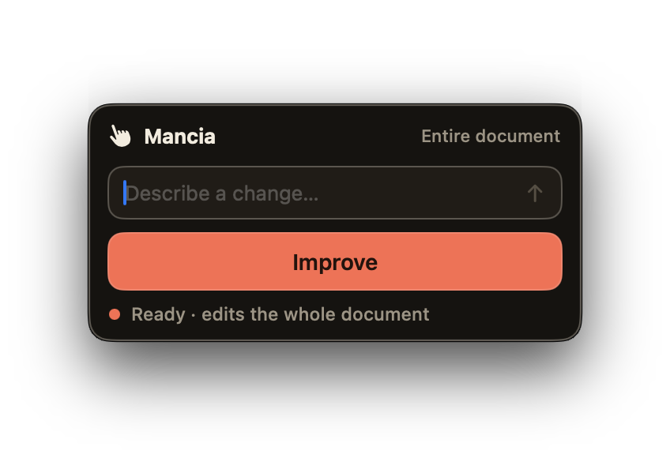

<p align="center">
  
</p>

# Mancia

<p align="center">
  <a href="https://github.com/peteriz/mancia/releases/latest"></a>
  <a href="https://github.com/peteriz/mancia/actions/workflows/ci.yml"></a>
  <a href="LICENSE"></a>
  
  
</p>

**AI text editing across macOS, without leaving the app where you write.**

Select text in a Mac app that supports standard copy and paste, press a global shortcut, and describe the change. Mancia uses GitHub Copilot CLI to rewrite the text in place—no chat window and no copy-paste loop.

<p align="center">
  
</p>

## What Mancia does

- Works in frontmost apps and text fields that support standard Copy, Select All, and Paste.
- Uses a configurable global shortcut.
- Opens a compact floating panel near your cursor.
- Edits the current selection, or attempts to edit all copyable text when nothing is selected.
- Offers one-tap **Improve** and a free-form instruction field.
- Replaces text in place and lets you move between original and generated versions.
- Restores your clipboard after every capture and paste.
- Stays in the menu bar without adding a Dock icon.

## Requirements

- macOS 14 or newer.
- [Node.js 22 or newer](https://nodejs.org) when installing Copilot CLI with `npm`.
- [GitHub Copilot CLI](https://docs.github.com/en/copilot/how-tos/set-up/install-copilot-cli) installed and signed in.
- A GitHub Copilot subscription.
- macOS Accessibility permission for copying and replacing text.

Install Copilot CLI, then run it and follow the `/login` prompt:

```sh
npm install -g @github/copilot
copilot
```

> [!TIP]
> If Mancia cannot find `copilot`, open **Settings** from the menu bar and enter its absolute path. Run `which copilot` in Terminal to find it.

Mancia runs the local `copilot` command in non-interactive mode. It does not connect directly to an AI API.

## Install

### Download a release

Download the latest `.dmg` from [GitHub Releases](https://github.com/peteriz/mancia/releases/latest), open it, and drag Mancia to **Applications**.

> [!NOTE]
> Mancia is not notarized yet. If macOS says it cannot open or verify the app, right-click Mancia in Finder, choose **Open**, then confirm. You can also allow it under **System Settings → Privacy & Security**.

If macOS still blocks the app, remove its quarantine metadata:

```sh
xattr -dr com.apple.quarantine /Applications/Mancia.app
```

Only run this command for a copy of Mancia you downloaded from this repository and trust. You only need to approve each build once; apps you compile yourself open normally.

### Build from source

Mancia is a Swift Package Manager project and does not use an Xcode project. Building requires Xcode or Command Line Tools with Swift 6.

```sh
git clone https://github.com/peteriz/mancia.git
cd mancia
make app
open build/Mancia.app
```

Copy `build/Mancia.app` to `/Applications` for a permanent install.

## First run

Mancia needs Accessibility permission to copy selected text and paste the result into the frontmost app.

1. Open Mancia.
2. Trigger the shortcut or choose **Edit Selection…** from the menu bar.
3. Enable Mancia under **System Settings → Privacy & Security → Accessibility** when prompted.

Development builds use ad-hoc signing by default, so macOS may ask again after a rebuild. Contributors can use an existing, stable local signing identity:

```sh
CODESIGN_ID="<existing codesigning identity>" make app
```

## Usage

1. Select text in an app that supports standard copy and paste.
2. Press <kbd>Control</kbd> + <kbd>Option</kbd> + <kbd>Command</kbd> + <kbd>E</kbd>, the default shortcut.
3. Choose **Improve**, or enter a custom instruction and submit it.
4. Review the result in the original app.
5. Use the arrows to switch versions, run another edit, or choose **Done**.

Try instructions such as “Make this more concise,” “Rewrite in a friendlier tone,” or “Turn these notes into bullet points.”

With no selection, Mancia uses Select All to capture the text it can copy. By default, it asks you to confirm **Replace document** before overwriting that text.

### Panel shortcuts

| Shortcut | Action |
| --- | --- |
| <kbd>Return</kbd> or <kbd>Command</kbd> + <kbd>Return</kbd> | Run the edit |
| <kbd>Left</kbd> / <kbd>Right</kbd> | Switch versions |
| <kbd>Command</kbd> + <kbd>,</kbd> | Open Settings |
| <kbd>Escape</kbd> or <kbd>Command</kbd> + <kbd>W</kbd> | Close the panel |

Standard macOS editing shortcuts work in the instruction field, including copy, paste, undo, and redo.

## Settings

Open **Settings** from the menu bar to:

- Change the global shortcut.
- Choose a Copilot model and reasoning effort when available.
- Set or detect the Copilot CLI path.
- Launch Mancia at login.
- Choose whether the panel closes or stays open after an edit.

## Privacy and security

Mancia temporarily uses the pasteboard to read and replace text, then restores its previous contents.

Mancia has no analytics or telemetry and does not call AI APIs directly. It sends captured text and your instruction to the local Copilot CLI process, which may send that content to GitHub Copilot services.

See our [security policy](SECURITY.md) to report a vulnerability.

## Development

| Command | What it does |
| --- | --- |
| `make build` | Build a debug executable |
| `make test` | Run unit tests |
| `make app` | Assemble `build/Mancia.app` |
| `make dmg` | Create `build/Mancia-<version>.dmg` |
| `make run` | Build and open the app |
| `make clean` | Remove build output |

Provider-only checks:

```sh
swift run Mancia --provider-check
echo "some text" | swift run Mancia --complete rewrite
```

## Contributing and support

Contributions are welcome. Read the [contributing guide](docs/CONTRIBUTING.md) before opening a pull request, and follow the [Code of Conduct](CODE_OF_CONDUCT.md).

Found a bug or have an idea? [Open an issue](https://github.com/peteriz/mancia/issues/new/choose).

Project references:

- [Architecture](docs/ARCHITECTURE.md)
- [Original implementation spec (historical)](docs/SPEC.md)
- [Changelog](CHANGELOG.md)

## License

Mancia is available under the [MIT License](LICENSE).
