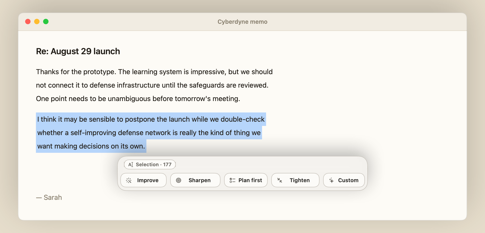

<p align="center">
  
</p>

<h1 align="center">Mancia</h1>

<p align="center">
  <b>Edit text with AI in any macOS app, without leaving the app you write in.</b>
</p>

<p align="center">
  <a href="https://github.com/peteriz/mancia/releases/latest"></a>
  <a href="https://github.com/peteriz/mancia/actions/workflows/ci.yml"></a>
  <a href="LICENSE"></a>
  
  
</p>

Select text anywhere on your Mac, choose the result you need, and Mancia runs
the edit through GitHub Copilot CLI and replaces the text in place — no chat
window, no copy-paste round trip.

<p align="center">
  
</p>

- Reads text through standard **Copy**. In-place replacement also needs
  Accessibility evidence identifying the editable field and its contents.
  If Mancia cannot verify a safe replacement, it keeps the result available
  to copy instead of guessing where to paste.
- The ribbon opens **against the text you selected**: below or above a short
  selection, beside a tall block, and at a predictable fallback position when
  there is no room.
- **Improve** clarifies coding-agent requests and everyday prose, **Sharpen**
  turns rough requests into clear instructions, **Plan first** rewrites a
  request to ask an agent for a short plan with goals and verifiers before
  implementation, and **Tighten** cuts words without losing requirements.
- **Custom** applies a free-form instruction, such as changing tone or format.
- Use **Undo** or **⌘Z** to restore a previous Mancia-applied version when the
  target can still be verified. Mancia never blindly undoes the host app's
  latest operation.
- Cancel a running request without closing the ribbon, and retry or copy details
  when the provider reports an error.
- Clipboard contents are restored only while Mancia still owns its temporary
  copy. Anything you copy while an edit runs takes precedence.
- No telemetry, no Dock icon, no direct calls to any AI API.

## Install

Download the latest `.dmg` from
[Releases](https://github.com/peteriz/mancia/releases/latest), open it, and drag
Mancia to **Applications**.

Or build it — Mancia is a Swift Package, with no Xcode project:

```sh
git clone https://github.com/peteriz/mancia.git
cd mancia
make app && open build/Mancia.app
```

> [!NOTE]
> Release builds are not notarized yet. If macOS refuses to open the app,
> right-click it in Finder and choose **Open**, or run
> `xattr -dr com.apple.quarantine /Applications/Mancia.app`. Apps you compile
> yourself open normally.

## Set up

**1. GitHub Copilot CLI** does the actual editing, so install it and sign in.
It needs [Node.js 22+](https://nodejs.org) and a Copilot subscription.

```sh
npm install -g @github/copilot
copilot   # then follow the /login prompt
```

> [!TIP]
> If Mancia cannot find `copilot`, run `which copilot` and paste the absolute
> path into **Settings**.

**2. Accessibility permission** lets Mancia copy your selection and paste the
result back. Trigger the shortcut once and approve Mancia under **System
Settings → Privacy & Security → Accessibility**. Development builds are ad-hoc
signed, so macOS asks again after each rebuild.

## Use it

1. Select text in any app.
2. Press <kbd>⌃</kbd><kbd>⌥</kbd><kbd>⌘</kbd><kbd>E</kbd>.
3. Click **Improve**, **Sharpen**, **Plan first**, or **Tighten** to run that
   action immediately. For anything else, click **Custom**, enter an instruction
   such as *“make it decisive, one sentence”* or *“turn these notes into bullets”*,
   then press <kbd>Return</kbd> or click **Run**.

The target control shows whether the action uses a selection or the whole
document. When the field and original text still match, the result replaces
the selection in place. If the target changed or cannot be verified, Mancia
keeps the result available through **Copy result**.

With no selection, Mancia asks before reading and sending the whole document
through Copilot. It then asks separately before replacing the document, with
the result and an optional comparison available to inspect. Only the second
confirmation can be disabled in Settings.

Custom instructions stay available for refinement during the open session.
Presets preserve meaningful selection-edge whitespace; Custom can deliberately
change language or format. Replacement uses plain text, so rich-text styling
and links are not guaranteed to survive.

| Key | Does |
| --- | --- |
| <kbd>⌃⌥⌘E</kbd> | Open an edit session (configurable in Settings) |
| <kbd>1</kbd> / <kbd>2</kbd> / <kbd>3</kbd> / <kbd>4</kbd> | Run Improve / Sharpen / Plan first / Tighten while the ribbon has focus, except when typing in Custom |
| <kbd>5</kbd> | Open Custom while the ribbon has focus; digits remain normal text inside its editor |
| <kbd>Return</kbd> | Activate the focused control or submit Custom; review and approval buttons must be focused explicitly |
| <kbd>⌘Return</kbd> | Run the current action unless a request or approval is in progress |
| <kbd>Tab</kbd> / <kbd>⇧Tab</kbd> | Move forward / backward through the ribbon controls |
| <kbd>⌘T</kbd> | Switch between the current selection and the whole document when a selection exists |
| <kbd>⌘Z</kbd> | Undo typing in Custom first; otherwise restore the previous Mancia-applied version |
| <kbd>⌘⇧Z</kbd> | Redo typing in the Custom field |
| <kbd>⌘A</kbd> / <kbd>⌘X</kbd> / <kbd>⌘C</kbd> / <kbd>⌘V</kbd> | Edit text in the Custom field |
| <kbd>⌘,</kbd> | Open Settings |
| <kbd>Esc</kbd> | Cancel a request, decline a pending approval, or collapse an open retained result; otherwise close |
| <kbd>⌘W</kbd> | Close the ribbon |

**Settings** changes the global shortcut, whole-document replacement
confirmation, post-edit close behavior, and launch at login. Its Advanced
section controls the Copilot model, reasoning effort, CLI path, and working
color. Provider **Installed** means the CLI launches; sign-in and service
availability are checked when an action runs. The model recommendation is
based on speed and cost, not a claim of superior editing quality.

## Privacy

Mancia has no analytics or telemetry and never calls an AI API directly. It
passes your selected text and instruction to the local `copilot` process, which
may send them on to GitHub Copilot services. The pasteboard is used to read and
replace text, then restored if it has not been replaced by a newer copy.

Report a vulnerability through our [security policy](SECURITY.md).

## Website

The landing page lives in [`site/`](site/) and deploys through GitHub Pages.
See the [Pages deployment guide](docs/GITHUB_PAGES.md) for repository setup and
manual deployment steps.

## Contributing

Contributions are welcome — read the [contributing guide](docs/CONTRIBUTING.md)
and the [Code of Conduct](CODE_OF_CONDUCT.md) first, then
[open an issue](https://github.com/peteriz/mancia/issues/new/choose) or a pull
request.

```sh
make build   # debug build
make test    # unit tests
make run     # build the .app and launch it
```

Action-quality examples are synthetic and do not run against Copilot in CI.
To evaluate the configured model explicitly:

```sh
node scripts/evaluate_action_quality.mjs
node scripts/evaluate_action_quality.mjs downstream-plan-request
```

Each selected case sends one request through Copilot. The script reports
literal-preservation checks and prints the result with review criteria.
Review meaning, uncertainty, and completeness yourself; passing the literal
checks does not prove semantic fidelity.

For changes to capture or replacement, exercise a scratch document in TextEdit
and a browser text field or VS Code. Include copying while generation runs,
changing fields or documents, editing the baseline before confirming,
cancelling before paste, and attempting Undo after a manual edit. The safe
fallback is a retained result, not an unverified overwrite.

Copilot CLI is the only provider today; `Sources/Mancia/Providers` is the
extension point for others. See [Architecture](docs/ARCHITECTURE.md) for how
the pieces fit, and the [Changelog](CHANGELOG.md) for what has landed.

## License

[MIT](LICENSE)
